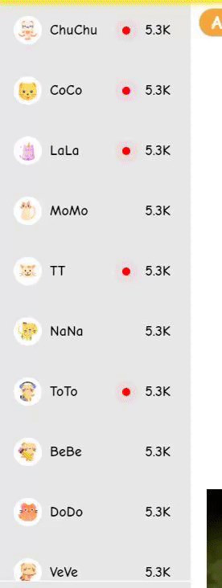
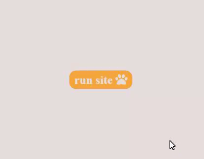

# Streaming site cat edition
Written with only HTML and CSS for the Binary Studio Academy 2022

## The site is implemented
- A lot of hover effects
    
- Cyclic gallery of cats
    
- Custom scrollbar
    
- Media queries are implemented up to 310px, if you zoom out more, you will see an Easter egg (an inscription that the screen is too small for the cats' paws)
    
## Features on the site 
- Added a fake preloader, it lasts 2 seconds then the launch button appears to start the site
    
  Then the launch button appears to start the site
    
- Added popup that will appear in 5 seconds (counting from pressing the launch button on the fake preloader)
   If you click outside the popup, it will close
    
- Added a dark theme for the site, to switch to it, you need to click on the month in the header
    
